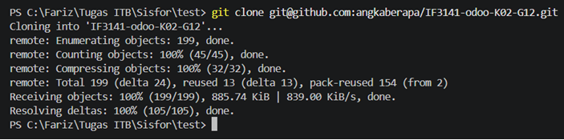
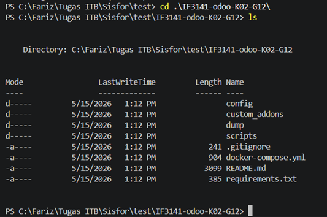
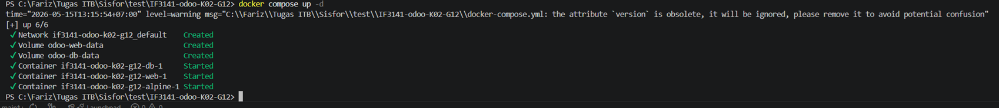
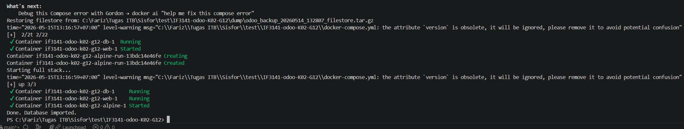
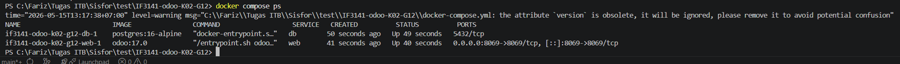
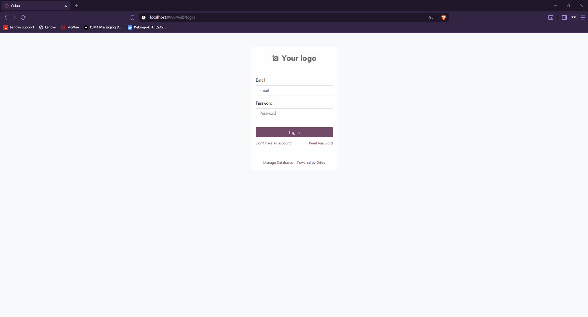
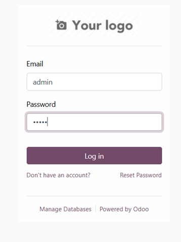
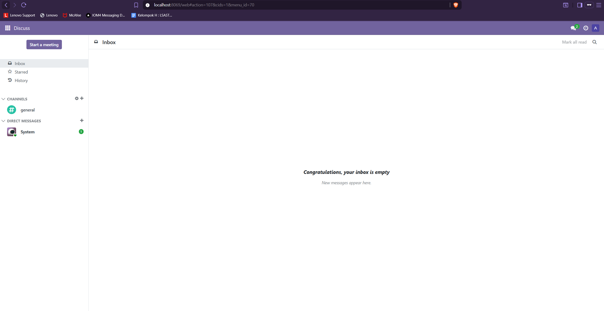
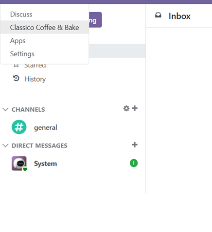
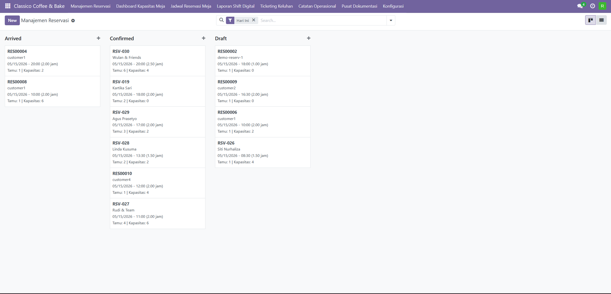

# Sistem Operasional dan Reservasi Terintegrasi Classico Coffee & Bake

Repository ini berisi implementasi sistem informasi berbasis Odoo 17 untuk mendukung proses operasional, reservasi, dan evaluasi layanan pada Classico Coffee & Bake. Proyek ini dikembangkan sebagai bagian dari Tugas Besar IF3141 Sistem Informasi.

## Identitas Kelompok

| Informasi | Detail |
| --- | --- |
| Nomor Kelas | K02 |
| Nomor Kelompok | G12 |
| Nama Kelompok | Classico Coffee & Bake |
| Nama Sistem | Sistem Operasional dan Reservasi Terintegrasi Classico Coffee & Bake |
| Perusahaan | Classico Coffee & Bake |

## Anggota Kelompok

| NIM | Nama |
| --- | --- |
| 13523069 | Mochammad Fariz Rifqi R |
| 13523095 | Rafif Farras |
| 13523102 | Michael Alexander Angkawijaya |
| 13523107 | Heleni Gratia M Tampubolon |
| 13523110 | Andrew Isra Saputra DB |
| 13523121 | Ahmad Wicaksono |

## Deskripsi Sistem

Sistem Operasional dan Reservasi Terintegrasi Classico Coffee & Bake adalah sistem informasi berbasis Odoo yang dirancang untuk membantu digitalisasi proses operasional restoran dan kafe. Sistem ini berfokus pada pengelolaan reservasi pelanggan, pemantauan kapasitas meja, pencatatan shift operasional, pengelolaan keluhan pelanggan, dokumentasi operasional, serta penyusunan laporan evaluasi. Dengan adanya sistem ini, aktivitas yang sebelumnya tersebar dalam komunikasi manual dapat dipusatkan dalam satu platform yang lebih terstruktur, terdokumentasi, dan mudah dipantau oleh pihak operasional.

Sistem ini dikembangkan untuk mendukung kebutuhan beberapa role pengguna, yaitu Admin, Restaurant Manager, dan Staff Operational. Admin bertanggung jawab terhadap pengelolaan pengguna serta konfigurasi sistem, Restaurant Manager dapat memantau data operasional dan mengevaluasi performa layanan, sedangkan Staff Operational dapat menjalankan aktivitas harian seperti mencatat reservasi, memperbarui status meja, mencatat shift, dan menangani keluhan pelanggan. Pendekatan berbasis role ini membantu menjaga hak akses pengguna tetap sesuai dengan tanggung jawab masing-masing.

## Fitur Utama

| Modul | Deskripsi |
| --- | --- |
| Manajemen Reservasi | Mencatat dan mengelola reservasi pelanggan. |
| Manajemen Meja | Memantau status dan kapasitas meja secara operasional. |
| Shift Operasional | Mencatat informasi shift dan aktivitas harian staf. |
| Keluhan Pelanggan | Mendokumentasikan dan menindaklanjuti keluhan pelanggan. |
| Dokumentasi Operasional | Menyimpan catatan dan arsip operasional. |
| Laporan Evaluasi | Membantu penyusunan laporan evaluasi operasional. |
| Manajemen Role Pengguna | Mengatur akses pengguna berdasarkan peran dalam sistem. |

## Prasyarat

Pastikan perangkat yang digunakan telah memiliki dependency berikut:

| Dependency | Keterangan |
| --- | --- |
| Docker Desktop | Menjalankan service Odoo dan PostgreSQL melalui container. |
| Git | Mengambil source code repository. |
| Browser modern | Mengakses antarmuka Odoo melalui `http://localhost:8069`. |
| Python 3.11 | Opsional, digunakan untuk kebutuhan development modul lokal. |

## Struktur Repository

| Path | Keterangan |
| --- | --- |
| `config/` | Konfigurasi Odoo. |
| `custom_addons/` | Modul kustom Odoo yang dikembangkan untuk sistem. |
| `dump/` | Folder penyimpanan file dump database dan filestore. |
| `scripts/` | Script untuk proses import dan export database. |
| `docker-compose.yml` | Konfigurasi service Odoo 17 dan PostgreSQL 16. |
| `requirements.txt` | Dependency Python untuk kebutuhan development. |

## Cara Menjalankan Sistem

Bagian ini menjelaskan alur menjalankan sistem dari repository lokal hingga modul dapat digunakan melalui browser. Screenshot pada setiap langkah menunjukkan expected result yang perlu diperoleh ketika langkah berhasil dijalankan.

### 1. Clone Repository

Clone repository ke komputer lokal menggunakan Git.

```bash
git clone git@github.com:angkaberapa/IF3141-odoo-K02-G12.git
```

Expected result: repository berhasil tersedia pada komputer lokal.



### 2. Masuk ke Root Repository

Masuk ke folder repository hasil clone.

```bash
cd IF3141-odoo-K02-G12
```

Expected result: terminal berada pada root repository yang memiliki file `docker-compose.yml`.



### 3. Jalankan Container Awal

Jalankan service Odoo dan PostgreSQL melalui Docker Compose.

```bash
docker compose up -d
```

Expected result: container Odoo dan PostgreSQL berhasil dibuat dan berjalan di background.



### 4. Import Database dan Filestore

Untuk environment baru, import database terlebih dahulu agar data user, role, modul, dan data awal sistem tersedia. Hentikan container, jalankan script import, lalu nyalakan kembali container.

Windows:

```bat
docker compose down
scripts\import_db.cmd
docker compose up -d
```

macOS/Linux:

```bash
docker compose down
./scripts/import_db.sh
docker compose up -d
```

Expected result: database dan filestore hasil pengembangan berhasil dimuat ke environment lokal.



### 5. Verifikasi Container

Pastikan service Odoo dan PostgreSQL berjalan dengan baik.

```bash
docker compose ps
```

Expected result: service `web` dan `db` berada pada status running.



### 6. Akses Odoo dari Browser

Buka aplikasi melalui browser.

```text
http://localhost:8069
```

Expected result: halaman login Odoo tampil pada browser.



### 7. Login ke Sistem

Login menggunakan salah satu kredensial yang tersedia pada bagian [Kredensial Pengguna](#kredensial-pengguna). Gunakan role yang ingin diuji, misalnya Admin, Restaurant Manager, atau Staff Operational.

Expected result: pengguna berhasil masuk ke Odoo sesuai role yang digunakan.





### 8. Buka Menu Sistem

Buka menu aplikasi **Sistem Operasional dan Reservasi Terintegrasi Classico Coffee & Bake** melalui launcher Odoo.

Expected result: menu utama modul sistem tampil dan dapat diakses.



### 9. Akses Fitur Utama

Coba akses fitur utama seperti Reservasi, Meja, Shift, Keluhan, Dokumentasi Operasional, atau Laporan Evaluasi.

Expected result: halaman fitur dapat dibuka dan data dapat dikelola sesuai hak akses role.



### Perintah Singkat

Windows:

```bat
git clone git@github.com:angkaberapa/IF3141-odoo-K02-G12.git
cd IF3141-odoo-K02-G12
docker compose up -d
docker compose down
scripts\import_db.cmd
docker compose up -d
docker compose ps
```

macOS/Linux:

```bash
git clone git@github.com:angkaberapa/IF3141-odoo-K02-G12.git
cd IF3141-odoo-K02-G12
docker compose up -d
docker compose down
./scripts/import_db.sh
docker compose up -d
docker compose ps
```

Setelah service berjalan, akses aplikasi melalui browser:

```text
http://localhost:8069
```

Untuk menghentikan service:

```bash
docker compose down
```

## Aktivasi atau Update Modul

Apabila modul belum muncul atau terdapat perubahan pada kode modul, lakukan langkah berikut melalui Odoo:

1. Login sebagai Admin.
2. Buka menu **Apps**.
3. Aktifkan developer mode apabila diperlukan.
4. Klik **Update Apps List**.
5. Cari modul **Sistem Operasional dan Reservasi Terintegrasi Classico Coffee & Bake**.
6. Klik **Install** atau **Upgrade** sesuai kebutuhan.

## Kredensial Pengguna

Gunakan kredensial berikut untuk mencoba sistem berdasarkan role yang telah diimplementasikan.

| Username | Password | Role |
| --- | --- | --- |
| `admin` | `admin` | Admin |
| `res_manager1` | `res_manager1` | Restaurant Manager |
| `staff1` | `staff1` | Staff Operational |
| `staff2` | `staff2` | Staff Operational |
| `staff3` | `staff3` | Staff Operational |

## Database Migration

Repository ini menyediakan script untuk melakukan export dan import database beserta filestore. Sebelum menjalankan proses migrasi database, hentikan container terlebih dahulu.

```bash
docker compose down
```

Export database:

| Sistem Operasi | Perintah |
| --- | --- |
| Windows | `scripts\export_db.cmd` |
| macOS/Linux | `./scripts/export_db.sh` |

Import database:

| Sistem Operasi | Perintah |
| --- | --- |
| Windows | `scripts\import_db.cmd` |
| macOS/Linux | `./scripts/import_db.sh` |

## Troubleshooting

| Kendala | Solusi |
| --- | --- |
| `http://localhost:8069` belum dapat diakses | Pastikan container sudah berjalan dengan `docker compose ps`, lalu tunggu beberapa saat karena Odoo memerlukan waktu inisialisasi. |
| Port `8069` sudah digunakan | Hentikan aplikasi lain yang menggunakan port tersebut atau ubah mapping port pada `docker-compose.yml`. |
| Modul tidak muncul di Apps | Login sebagai Admin, aktifkan developer mode, lalu lakukan **Update Apps List**. |
| Perubahan kode belum terlihat | Restart container dengan `docker compose restart web`, lalu upgrade modul dari Apps. |

## Kesimpulan dan Saran

Sistem Operasional dan Reservasi Terintegrasi Classico Coffee & Bake membantu memusatkan proses reservasi, operasional harian, penanganan keluhan, serta evaluasi layanan dalam satu platform berbasis Odoo. Dengan sistem ini, proses kerja menjadi lebih terdokumentasi, akses informasi antar-role menjadi lebih jelas, dan aktivitas operasional dapat dipantau secara lebih konsisten.

Ke depannya, sistem dapat dikembangkan lebih lanjut dengan integrasi notifikasi pelanggan, dashboard analitik yang lebih komprehensif, serta otomatisasi laporan periodik untuk mendukung pengambilan keputusan manajerial. Selain itu, pengujian end-to-end untuk setiap role juga disarankan agar kualitas sistem tetap terjaga ketika fitur baru ditambahkan.
